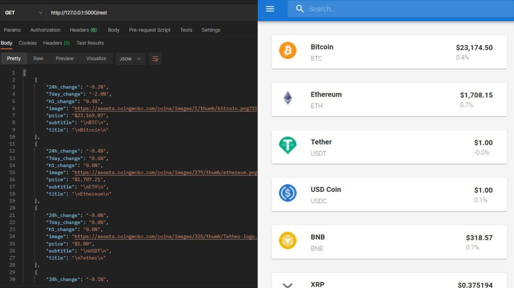

## Introduction

Have you ever wanted to get data from a website in real time and that website did not have any api or resource for this, well, I was in the same situation and I was able to solve this problem by using [scrapyrt](https://scrapyrt.readthedocs.io/en/stable/).

So in my case i tried to crawel [coingecko](https://www.coingecko.com/) website by sending a requests to it and to parse the HTML code i grab each currency title , icon image , price , 1h change , 24h change , 7chnage. thats all i need for this project you can add more features by exploring more html codes

After Scrap data and convert it into a api i used flask to decode scrapyrt api, i created a simple webapp using react js to test it

## Setup and Run Project

### 1 - Install requirement libraries and packages realtimescraper  : -

`cd yourdir/cryptorealtimescraper/realtimescraper`

Install packages by running :

`pip install -r requirements.txt`

Run realtimescraper (back side) by runinng :

`scrapyrt`

than you can see raw result by opening :

http://127.0.0.1:5000/rest

And

`python app.py`

than you can see decoded json result by opening :

http://127.0.0.1:5000/rest

### 2 - Install requirement libraries and packages reactapp   : -

`cd yourdir/cryptorealtimescraper/reactapp`

Install packages by running :

`npm install -g node-modules`

Run reactapp (front side) by runinng :

`npm  start`

than you can see webapp by opening :

http://localhost:3000/
